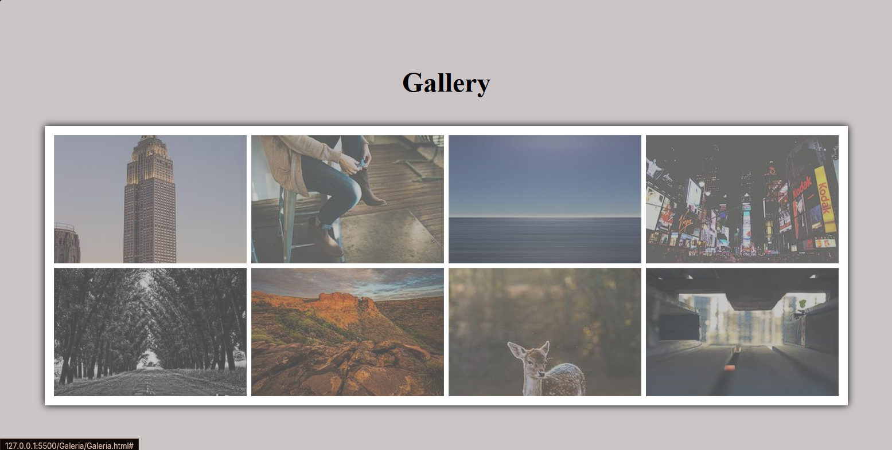

# Projeto Galeria Aleatória

### 📝 Descrição

Projeto desenvolvido para simular uma galeria de imagens aleatórias, com foco em elementos de transição e transformação no CSS3.

### 👀 Demonstração

#### Seção Principal/Conteúdo

Foco na área central da página, onde a maior parte do conteúdo e interatividade acontece.



### 💻 Tecnologias utilizadas

- HTML5
- CSS3

### 🎯 Objetivos de aprendizado

- Aplicação da tag `scale` no CSS3.
- Reforço ao uso do `z-index`.
- Uso de imagens de outros domínios.
- Pratica do uso e conceitos de `::after` e `::before`.

### 📲 Instalação

1. Clone o repositório:

```bash
git clone https://github.com/Murilo-front/Galeria-Aleatoria.git meu-projeto
```

2. Acesse a pasta do projeto:

```bash
cd meu-projeto
```

3. Abra o arquivo index.html no navegador:

- Clique duas vezes no arquivo ou

- Use um editor como o Visual Studio Code e a extensão Live Server.
